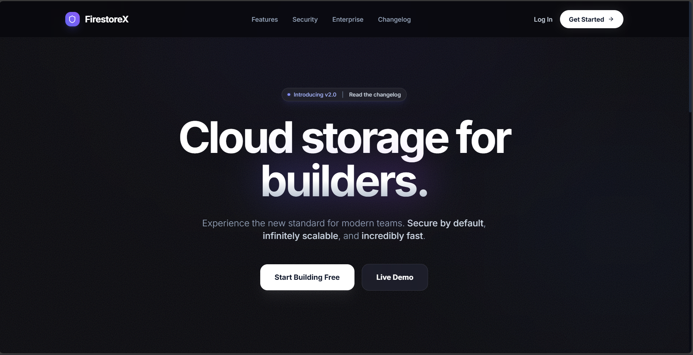
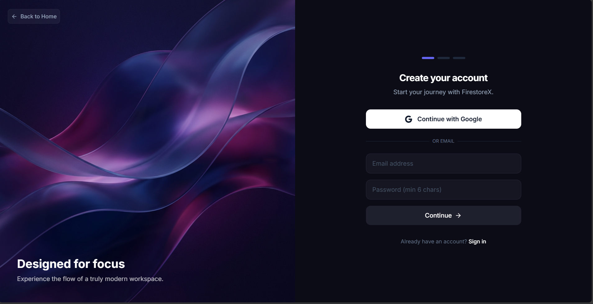
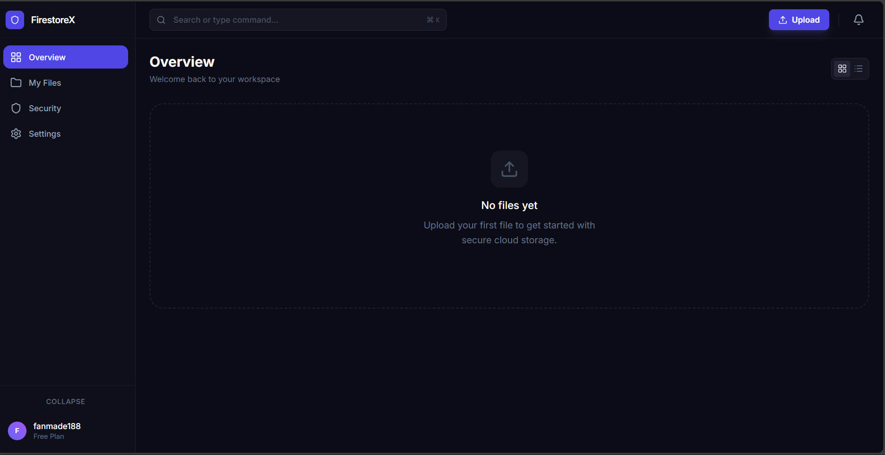

# FirestoreX - Next Generation Secure Cloud Storage

> **Academic Capstone Project**
> *Developed by me-intenzo*

## Abstract

FirestoreX is a secure-by-design cloud storage and collaboration platform. It addresses the growing need for privacy-focused digital workspaces by implementing zero-knowledge encryption principles while maintaining a modern, high-performance user experience. This project demonstrates advanced web development techniques, including real-time state management, cryptographic security implementation, and responsive UI design.

## Key Features

-   **Zero-Knowledge Security**: Architecture designed to ensure user data remains private.
-   **Modern User Interface**: Responsive "Bento Grid" layout with "Spotlight" interactions and smooth Framer Motion animations.
-   **Real-time Feedback**: Integrated toast notification system for immediate user feedback.
-   **Secure Authentication**: Role-based access control (RBAC) powered by Supabase Auth and Database Triggers.
-   **High Performance**: Optimized for speed with edge-ready architecture considerations.

## Technology Stack

-   **Frontend**: React.js, Vite
-   **Styling**: Tailwind CSS, PostCSS
-   **Animations**: Framer Motion
-   **Backend/Database**: Supabase (PostgreSQL)
-   **State Management**: React Context API
-   **Notifications**: Sonner
-   **Cloud**: Supabase

## Project Structure

```bash
firestore/
├── database/           # SQL schemas and setup scripts
├── src/
│   ├── components/     # Reusable UI components
│   │   ├── features/   # Key pages (Landing, Login, Register)
│   │   └── ui/         # Atomic UI elements (Spinner, etc)
│   ├── contexts/       # Global state (Auth)
│   └── services/       # API integration layers
├── public/             # Static assets
└── ...config files
```

## Screenshots

### Landing Page
> A modern, interactive landing page with parallax effects.


### User Registration
> Secure registration flow with robust validation.


### Dashboard
> The main workspace interface.


## Installation & Setup

1.  **Clone the repository**
    ```bash
    git clone https://github.com/me-intenzo/firestoreX
    cd firestore
    ```

2.  **Install Dependencies**
    ```bash
    npm install
    ```

3.  **Environment Setup**
    Create a `.env` file with your Supabase credentials:
    ```env
    VITE_SUPABASE_URL=your_supabase_url
    VITE_SUPABASE_ANON_KEY=your_supabase_anon_key
    ```

4.  **Database Setup**
    Run the SQL script found in `database/supabase-setup.sql` in your Supabase SQL Editor.

5.  **Run Locally**
    ```bash
    npm run dev
    ```

## License & Policies

This project is for academic purposes.
