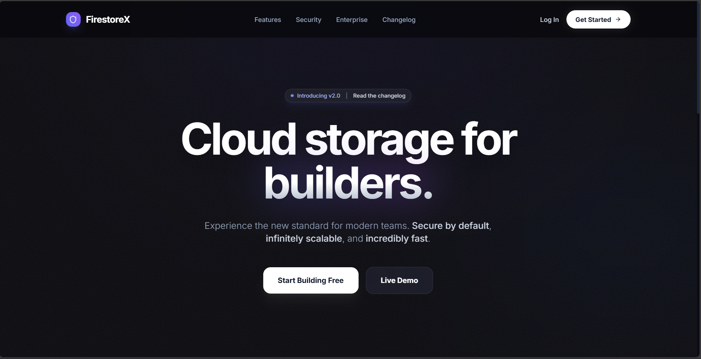
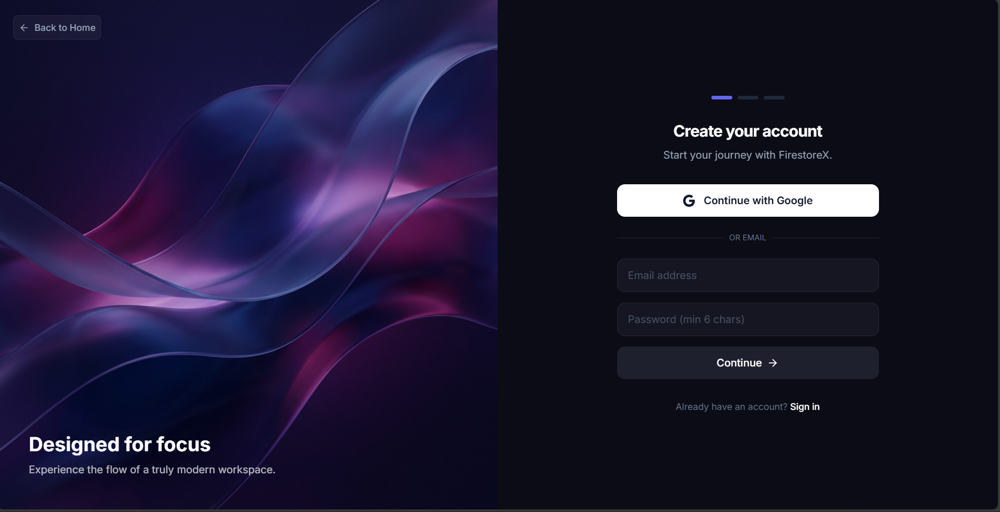
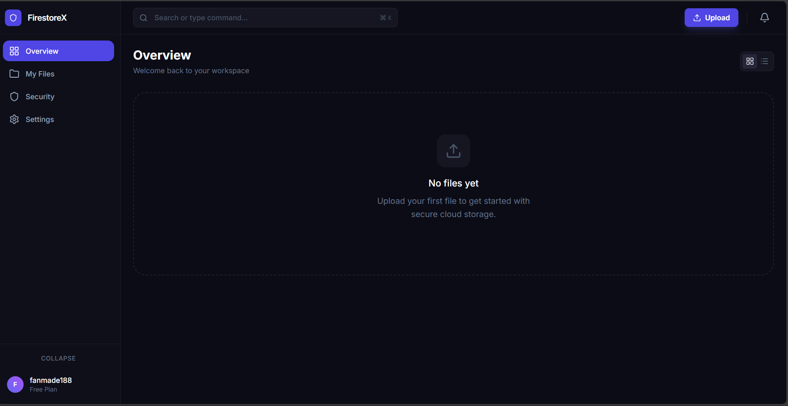

# FirestoreX - Next Generation Secure Cloud Storage

> **Academic Capstone Project**
> *Developed by me-intenzo*

## Abstract

FirestoreX is a secure-by-design cloud storage and collaboration platform. It addresses the growing need for privacy-focused digital workspaces by implementing zero-knowledge encryption principles while maintaining a modern, high-performance user experience. This project demonstrates advanced web development techniques, including real-time state management, cryptographic security implementation, and responsive UI design.

## Key Features

-   **Client-Side Encryption**: AES-256-GCM encryption for file security
-   **Secure File Sharing**: Password-protected, time-limited share links with download limits
-   **Modern User Interface**: Responsive "Bento Grid" layout with "Spotlight" interactions and smooth Framer Motion animations
-   **Real-time Feedback**: Integrated toast notification system for immediate user feedback
-   **Secure Authentication**: Role-based access control (RBAC) powered by Supabase Auth
-   **Activity Logging**: Comprehensive audit trail for security events

## Technology Stack

-   **Frontend**: React.js, Vite
-   **Styling**: Tailwind CSS, PostCSS
-   **Animations**: Framer Motion
-   **Backend/Database**: Supabase (PostgreSQL)
-   **Security**: Web Crypto API (AES-256-GCM), bcryptjs
-   **State Management**: React Context API
-   **Notifications**: Sonner

## Project Structure

```bash
firestore/
├── database/           # SQL schemas and setup scripts
├── src/
│   ├── components/     # Reusable UI components
│   │   ├── features/   # Key pages (Landing, Login, Register)
│   │   └── ui/         # Atomic UI elements (Spinner, etc)
│   ├── contexts/       # Global state (Auth)
│   └── services/       # API integration layers
├── public/             # Static assets
└── ...config files
```

## Screenshots

### Landing Page
> A modern, interactive landing page with parallax effects.


### User Registration
> Secure registration flow with robust validation.


### Dashboard
> The main workspace interface.


## Installation & Setup

1.  **Clone the repository**
    ```bash
    git clone https://github.com/me-intenzo/firestoreX
    cd firestore
    ```

2.  **Install Dependencies**
    ```bash
    npm install
    ```

3.  **Environment Setup**
    Create a `.env` file with your Supabase credentials:
    ```env
    VITE_SUPABASE_URL=your_supabase_url
    VITE_SUPABASE_ANON_KEY=your_supabase_anon_key
    ```

4.  **Database Setup**
    Run these SQL scripts in your Supabase SQL Editor:
    ```bash
    # First, run the main setup
    database/supabase-setup.sql
    
    # Then, run Phase 2 security enhancements
    database/phase2_security_enhancements.sql
    ```

5.  **Run Locally**
    ```bash
    npm run dev
    ```

## Security Features

### Phase 2 Implementation ✅

-   **Client-Side Encryption**: Files encrypted with AES-256-GCM before upload
-   **Password Protection**: bcrypt hashing (12 rounds) for share link passwords
-   **Time-Limited Shares**: Set expiration times for shared links
-   **Download Limits**: Restrict number of downloads per share link
-   **Secure Tokens**: Cryptographically secure share token generation
-   **Activity Logging**: Comprehensive audit trail for all file operations

For detailed security documentation, see:
- `SECURITY_ARCHITECTURE.md` - Architecture diagrams

## Usage

### Uploading Files
1. Navigate to Dashboard
2. Click "Upload" or drag & drop files
3. Files are automatically encrypted client-side (optional)

### Sharing Files
1. Right-click on any file
2. Select "Share"
3. Configure security options:
   - Set password protection
   - Set link expiration (hours)
   - Set maximum downloads
4. Copy and share the secure link

## License & Policies

This project is for academic purposes.
